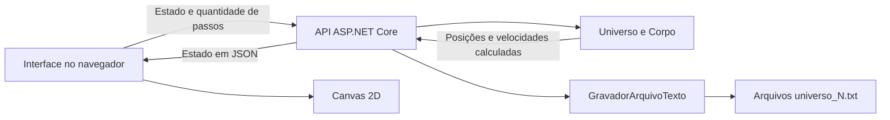

# Órbita — Documentação do simulador gravitacional 2D

## 1. Objetivo do projeto

O projeto simula a interação gravitacional entre corpos em um espaço bidimensional. Cada corpo possui massa, densidade, posição e velocidade próprias. Durante a simulação, a atração entre os corpos modifica suas acelerações, velocidades e posições; quando há contato físico, o programa trata colisões elásticas.

O universo inicial é gerado aleatoriamente pelo método `Universo.GerarCorposAleatorios`. Não existe uma estrela central obrigatória nem uma organização predefinida de planetas. Todos os corpos participam do cálculo gravitacional.

O programa original de console foi mantido. A interface web permite visualizar e controlar a mesma lógica física em um navegador, executando localmente.

## 2. Tecnologias utilizadas

| Tecnologia | Aplicação |
| --- | --- |
| C# e .NET 10 | Classes do domínio e cálculos físicos |
| ASP.NET Core | Servidor HTTP e integração entre a interface e o domínio |
| HTML e CSS | Estrutura, aparência e adaptação da interface a diferentes telas |
| JavaScript e Canvas 2D | Controles, desenho dos corpos, grade e trajetórias |
| Arquivos de texto | Persistência dos universos |
| PowerShell e arquivos `.cmd` | Inicialização, encerramento e supervisão do servidor local |
| Node.js | Execução dos scripts de verificação; não é necessário para usar o simulador |

A aplicação não depende de banco de dados, fontes externas ou serviços na internet.

## 3. Como executar localmente

### Inicialização para a apresentação

1. Tenha o SDK .NET 10 instalado e disponível no comando `dotnet`.
2. Na pasta do projeto, dê dois cliques em [Iniciar.cmd](Iniciar.cmd).
3. Aguarde a mensagem de que o simulador está pronto.
4. Use o navegador em **http://localhost:5080**.

Na primeira execução, o atalho publica a aplicação em `.local-runtime/app`. Depois inicia um supervisor e o servidor em segundo plano. Nas próximas execuções, reutiliza a instância existente.

O supervisor reinicia o processo do servidor caso ele encerre inesperadamente. Fechar o navegador não encerra o servidor. Para encerrá-lo intencionalmente, use [Parar.cmd](Parar.cmd). Depois de desligar ou reiniciar o computador, execute `Iniciar.cmd` novamente.

### Execução pelo terminal

Execute os comandos a partir da pasta raiz do projeto.

Interface web, mantendo o terminal aberto:

```powershell
dotnet run --project Web/TrabalhoN1.Web.csproj
```

Interface com supervisão em segundo plano, sem abrir o navegador:

```powershell
powershell -NoProfile -ExecutionPolicy Bypass -File Iniciar.ps1 -NoBrowser
```

Programa original de console:

```powershell
dotnet run --project TrabalhoN1.csproj
```

O projeto web no Visual Studio também está configurado para a porta **5080**. Para a apresentação, prefira `Iniciar.cmd`, que mantém a supervisão. Se o servidor já estiver ativo, abra o endereço existente em vez de iniciar outro servidor na mesma porta.

## 4. Organização dos arquivos

```text
TrabalhoN1/
├── Corpo.cs                       Representação e propriedades de um corpo
├── Universo.cs                    Gravitação, movimento e colisões
├── GravadorUniverso.cs             Persistência em arquivos de texto
├── Program.cs                     Menu do programa de console
├── TrabalhoN1.csproj               Projeto de console e classes do domínio
├── TrabalhoN1.slnx                 Solução com os projetos de console e web
├── Iniciar.cmd / Iniciar.ps1       Inicialização local
├── Parar.cmd / Parar.ps1           Encerramento local
├── README.md                      Guia rápido
├── DOCUMENTACAO.md                Documentação do projeto
├── Web/
│   ├── TrabalhoN1.Web.csproj       Projeto ASP.NET Core
│   ├── Program.cs                 Rotas HTTP e validação dos estados
│   ├── appsettings.json           Configuração dos registros do servidor
│   ├── Properties/
│   │   └── launchSettings.json    Configuração de execução no Visual Studio
│   └── wwwroot/
│       ├── index.html             Interface
│       ├── styles.css             Estilos responsivos
│       ├── app.js                 Controles e visualização
│       └── icon.svg               Ícone da aplicação
└── scripts/
    ├── serve-local.ps1            Supervisor do servidor
    ├── verify-api.mjs             Verificações HTTP e físicas
    ├── browser-helper.mjs         Comunicação com o navegador de teste
    ├── verify-browser.mjs         Verificações da interface
    └── verify-runtime.ps1         Verificações da inicialização e recuperação
```

As pastas `.local-runtime` e `.verification` contêm arquivos gerados durante a execução e as verificações. Os universos salvos ficam na pasta raiz como `universo_1.txt`, `universo_2.txt` e assim por diante.

## 5. Classes e orientação a objetos

### `Corpo`

Representa um corpo físico. Suas informações são:

| Propriedade | Significado | Unidade |
| --- | --- | --- |
| `Nome` | Identificação do corpo | Texto |
| `Massa` | Quantidade de matéria | kg |
| `Densidade` | Massa por unidade de volume | kg/m³ |
| `PosX`, `PosY` | Posição no plano | m |
| `VelX`, `VelY` | Componentes da velocidade | m/s |
| `ForcaX`, `ForcaY` | Componentes da força resultante | N |
| `AceleracaoX`, `AceleracaoY` | Componentes da aceleração | m/s² |
| `Raio` | Raio físico calculado pela massa e densidade | m |

**Encapsulamento:** os campos `nome`, `massa` e `densidade` são privados e acessados pelas propriedades públicas correspondentes. Os setters rejeitam nome vazio, massa não positiva e densidade não positiva ou superior ao limite definido pela classe. As demais grandezas usam propriedades automáticas. O raio é exposto apenas para leitura e calculado por um método privado.

A interface utiliza essas propriedades e o construtor existente; não torna os campos privados públicos. A camada web acrescenta validações para valores finitos, limites numéricos e compatibilidade dos nomes com o formato de arquivo.

### `Universo`

Agrupa os corpos e executa a simulação. Possui a coleção `Corpos`, o limite `QuantidadeIteracoes` e o intervalo físico `TempoEntreIteracoes`.

| Método | Responsabilidade |
| --- | --- |
| `AdicionarCorpo` | Adicionar um corpo à coleção |
| `GerarCorposAleatorios` | Construir corpos com propriedades sorteadas |
| `CalcularForcas` | Calcular a força gravitacional resultante em cada corpo |
| `AtualizarPosicoes` | Atualizar acelerações, posições e velocidades |
| `TratarColisoes` | Detectar contato e tratar os impactos |
| `ExibirEstado` | Mostrar posições e velocidades no console |
| `ExecutarSimulacao` | Executar os ciclos do programa de console |

Os cálculos de distância e de força entre dois corpos são métodos privados. A constante gravitacional também é privada. A propriedade `Corpos` possui setter privado, embora a lista retornada continue sendo uma coleção mutável.

### `GravadorUniverso` e `GravadorArquivoTexto`

`GravadorUniverso` é uma classe abstrata que define as operações `Salvar` e `Carregar`. `GravadorArquivoTexto` herda essa classe e implementa as operações usando arquivos `.txt`.

Essa organização demonstra abstração, herança e sobrescrita de métodos. O armazenamento é separado das classes responsáveis pela física.

## 6. Geração dos corpos aleatórios

O front-end chama a geração já implementada em `Universo.cs`.

| Grandeza | Intervalo utilizado pelo gerador |
| --- | --- |
| Massa | De 10²² até antes de 10²⁵ kg |
| Densidade | De 3.000 até antes de 6.000 kg/m³ |
| Posição em cada eixo | De −5 × 10⁹ até antes de +5 × 10⁹ m |
| Velocidade em cada eixo | De −200 até antes de +200 m/s |

Os limites superiores são exclusivos porque o gerador utiliza `Random.NextDouble()`, que retorna valores no intervalo de zero a menos de um. Os nomes seguem o padrão `Corpo 1`, `Corpo 2` etc.

A interface inicia com **12 corpos**, limite de **10.000 iterações** e passo físico de **3.600 segundos**. A quantidade pode ser alterada antes de gerar um novo universo. A interface permite de 1 a 100 corpos.

## 7. Cálculos físicos

### Distância entre os corpos

```text
dx = x₂ − x₁
dy = y₂ − y₁
r = √(dx² + dy²)
```

### Gravitação universal

```text
F = G × m₁ × m₂ / r²
G = 6,674184 × 10⁻¹¹ m³ kg⁻¹ s⁻²
```

A força é decomposta nos eixos X e Y utilizando a direção entre os corpos. A contribuição aplicada ao segundo corpo tem sentido contrário à aplicada ao primeiro, conforme a terceira lei de Newton.

As forças anteriores são zeradas antes de cada cálculo. Cada par é visitado uma única vez, usando `j = i + 1`. Para N corpos, existem `N × (N − 1) / 2` pares, portanto o cálculo de forças tem complexidade O(N²).

Quando a distância é exatamente zero, o código não calcula a atração desse par, evitando a divisão por zero.

### Aceleração, posição e velocidade

```text
a = F / m
s_nova = s_anterior + v_anterior × Δt + (a × Δt²) / 2
v_nova = v_anterior + a × Δt
```

Essas equações são aplicadas separadamente em cada eixo. O método aproxima a aceleração como constante durante um passo. A força é recalculada no ciclo seguinte.

### Raio físico

O corpo é considerado esférico para calcular seu raio, mesmo que o movimento seja representado em duas dimensões:

```text
volume = massa / densidade
raio = ∛(3 × volume / (4 × π))
```

### Colisões

Existe contato quando a distância entre dois corpos é menor ou igual à soma de seus raios físicos. O código calcula a normal do contato e a velocidade relativa nessa direção. Se os corpos estão se aproximando, aplica um impulso de colisão elástica e corrige a sobreposição. Se já estão se afastando, não aplica um novo impulso.

As colisões usam os raios físicos. Os círculos exibidos no navegador têm tamanho ampliado para facilitar a observação.

## 8. Integração entre a interface e o C#



O navegador mantém o estado do experimento aberto e envia esse estado ao servidor para avançar a simulação. O servidor reconstrói o universo e chama os métodos C# de forças, movimento e colisões. A resposta contém os novos estados dos corpos, que são desenhados no Canvas.

O JavaScript não implementa um segundo motor gravitacional. O servidor também não mantém uma simulação global em memória compartilhada entre todas as abas: cada solicitação de avanço recebe seu próprio estado. Os arquivos salvos ficam disponíveis na biblioteca local.

| Método HTTP | Rota | Operação |
| --- | --- | --- |
| GET | `/api/health` | Verificar a identidade e disponibilidade do servidor |
| POST | `/api/universes/create` | Gerar corpos aleatórios |
| POST | `/api/simulation/step` | Avançar a simulação |
| GET | `/api/universes` | Listar arquivos salvos |
| POST | `/api/universes/save` | Salvar um universo |
| GET | `/api/universes/{name}` | Carregar um arquivo |
| DELETE | `/api/universes/{name}` | Excluir um arquivo |
| POST | `/api/universes/export` | Produzir um arquivo para download |
| POST | `/api/universes/import` | Importar o conteúdo de um arquivo |

## 9. Funcionalidades da interface

| Controle | Comportamento |
| --- | --- |
| Gerar corpos aleatórios / Novo universo | Substituir o universo por novos corpos sorteados, após confirmação |
| Iniciar / Pausar | Controlar a execução dos passos |
| Avançar uma iteração | Executar um único passo enquanto a simulação está pausada |
| Restaurar | Voltar ao estado inicial mais recente |
| Limite de iterações | Definir o ponto de conclusão da execução |
| Passo de tempo | Definir o intervalo físico integrado por iteração |
| Velocidade de reprodução | Executar de 1 a 10 passos por atualização |
| Trajetórias | Exibir ou ocultar o histórico de posições retornadas |
| Nomes e grade | Alternar identificações e referências visuais |
| Zoom e enquadramento | Ampliar, reduzir ou enquadrar os corpos |
| Arrastar o espaço | Mover o referencial visual |
| Lista de corpos / Clique no corpo | Selecionar e consultar suas propriedades |
| Adicionar / Editar / Remover | Modificar a composição ou as condições iniciais |
| Salvar / Abrir / Excluir | Gerenciar os arquivos locais de universos |
| Importar / Exportar | Trocar universos por arquivos `.txt` |
| Como funciona | Abrir o guia de uso |

O passo de tempo aceito pela interface vai de **0,001 a 86.400 segundos**. O limite de iterações vai de **1 a 1.000.000**. A velocidade de reprodução altera a quantidade de cálculos, enquanto o passo de tempo altera o intervalo físico de cada cálculo.

Editar, adicionar ou remover um corpo redefine os contadores e o estado inicial usado pelo botão de restauração. O universo precisa manter pelo menos um corpo.

Os atalhos são espaço para iniciar ou pausar, `+` e `−` para zoom e `F` para enquadrar. Eles são destinados à página fora dos campos de edição e dos diálogos; botões mantêm seu comportamento normal de teclado.

## 10. Formato dos arquivos

O formato é separado por ponto e vírgula. A primeira linha contém:

```text
quantidadeCorpos;quantidadeIteracoes;tempoEntreIteracoes
```

Cada linha seguinte contém:

```text
nome;massa;densidade;posX;posY;velX;velY
```

Exemplo de um universo com dois corpos:

```text
2;10000;3600
Corpo 1;5e24;4500;-1e9;0;0;100
Corpo 2;8e24;5500;1e9;0;0;-100
```

A escrita utiliza números em formato independente da configuração regional. A leitura aceita ponto ou vírgula decimal. Nomes de corpos não devem conter ponto e vírgula nem quebras de linha.

Na interface, salvar ou exportar grava as posições e velocidades atuais. O formato não armazena o tempo acumulado, o contador já executado nem os rastros. Por isso, carregar ou importar inicia novos contadores a partir das condições gravadas.

## 11. Verificação do projeto

Compilação e sintaxe do JavaScript:

```powershell
dotnet build TrabalhoN1.slnx --nologo
node --check Web/wwwroot/app.js
```

Com o servidor em execução:

```powershell
node scripts/verify-api.mjs
```

Esse script verifica geração aleatória, limites, evolução dos corpos, gravitação, ação e reação, movimento de um corpo isolado, colisões e importação/exportação.

Para verificar a interface:

```powershell
node scripts/verify-browser.mjs
```

O script precisa de um Chrome de teste com depuração na porta **9222**. Verifica controles, edição, operações com arquivos, mouse, atalhos e layout em desktop e celular. As capturas são gravadas em `.verification`.

Para verificar o supervisor:

```powershell
powershell -NoProfile -ExecutionPolicy Bypass -File scripts/verify-runtime.ps1
```

Esse teste interrompe brevemente apenas o servidor identificado como pertencente a este projeto, verifica sua recuperação, testa os atalhos de encerramento e inicialização e deixa o servidor funcionando ao terminar.

Na validação realizada durante a implementação, passaram **25 verificações da API, 37 do navegador e 14 do servidor**, totalizando **76 verificações**. A compilação terminou sem erros ou avisos de compilação. Esses resultados descrevem a validação realizada; os comandos acima permitem verificar novamente a versão local.

## 12. Roteiro para apresentação

1. Abra `Iniciar.cmd` e mostre o universo com os corpos aleatórios.
2. Explique as faixas de massa, densidade, posição e velocidade.
3. Inicie a simulação e mostre a evolução das posições e dos rastros.
4. Pause e avance uma única iteração, relacionando-a ao passo de tempo físico.
5. Selecione um corpo e mostre massa, densidade, raio, velocidade e posição.
6. Edite uma propriedade para demonstrar a alteração das condições iniciais.
7. Salve o universo, abra a biblioteca e carregue o arquivo criado.
8. Mostre a opção de exportação e explique o formato `.txt`.
9. Apresente as classes `Corpo`, `Universo` e `GravadorArquivoTexto`, destacando encapsulamento e separação de responsabilidades.

Uma descrição breve do trabalho:

> O projeto simula a atração gravitacional entre corpos com características aleatórias em duas dimensões. As classes C# calculam as forças, atualizam o movimento e tratam colisões. A interface local permite acompanhar a evolução, alterar as condições iniciais e salvar os experimentos em arquivos de texto.

## 13. Precisão e manutenção

A simulação usa o método numérico já presente no projeto, que aproxima o movimento durante cada passo. Passos maiores e encontros próximos podem aumentar o erro. Reduza o passo de tempo quando precisar de maior precisão. A colisão é verificada após a atualização das posições, portanto passos grandes também podem deixar de detectar contatos que ocorram entre dois estados.

Os rastros mantêm até 800 posições retornadas por corpo. Em reprodução acelerada, registram o estado ao final de cada grupo de passos. Zoom e deslocamento alteram apenas a visualização.

O atalho reutiliza a versão publicada. Se o código for alterado depois, atualize essa versão com o servidor encerrado:

```powershell
powershell -NoProfile -ExecutionPolicy Bypass -File Parar.ps1
dotnet publish Web/TrabalhoN1.Web.csproj -c Release --nologo -o .local-runtime/app
powershell -NoProfile -ExecutionPolicy Bypass -File Iniciar.ps1
```

Para investigar problemas de inicialização, consulte `.local-runtime/supervisor.log`, `.local-runtime/server.log` e `.local-runtime/server-error.log`. A disponibilidade local pode ser consultada em **http://localhost:5080/api/health**.
